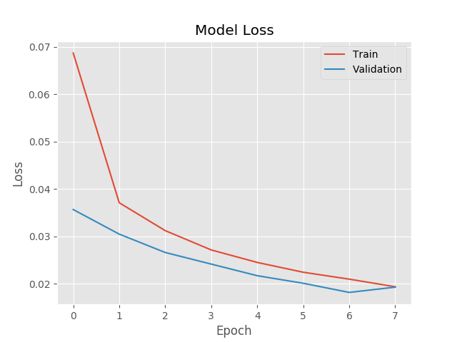
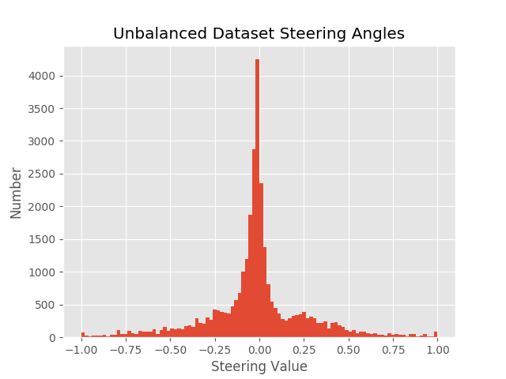
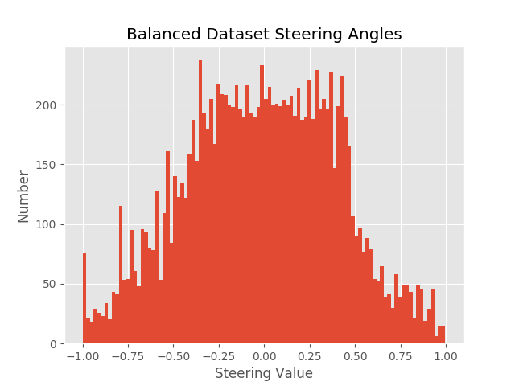
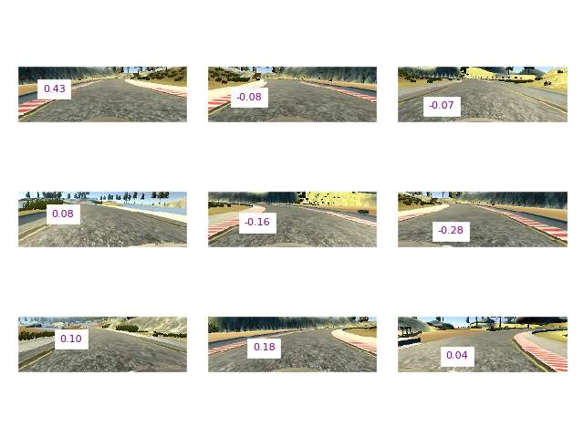
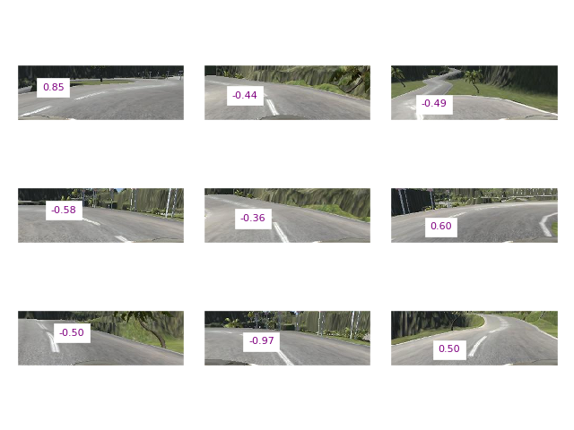

**Behavioral Cloning**
======================

[Bojarski_2016]: https://devblogs.nvidia.com/parallelforall/deep-learning-self-driving-cars/ "Bojarski et al. (2016)"

The goals / steps of this project are the following:

- Use the simulator to collect data of good driving behavior
- Build a convolution neural network in Keras that predicts steering angles
    from images
- Train and validate the model with a training and validation set
- Test that the model successfully drives around track one without leaving the
    road
- Summarize the results with a written report

Rubric Points
-------------

### Here I will consider the [rubric points](https://review.udacity.com/#!/rubrics/432/view) individually and describe how I addressed each point in my implementation.

### Files Submitted & Code Quality

#### 1. Submission includes all required files and can be used to run the simulator in autonomous mode

My project includes the following files.

- `model.py` containing the script to create and train the model
- `data.py` containing the helper methods to process data, and our generator function
- `plots.py` script to generate figures presented in this writeup
- `drive.py` for driving the car in autonomous mode
- `model.json` containing a summary of the trained convolution neural network
- `model.h5` containing the weights of the trained convolution neural network
- `final_simple_course.mov` a video of our autonomous vehicle driving the simple course
- `final_jungle_course.mov` a video of our autonomous vehicle driving the jungle course (though with some errors/crashes)
- `jungle_overview.mov` a top-down video of our vehicle navigating a portion of the jungle course
- `writeup.md` and `writeup.pdf`: this document, summarizing the results

#### 2. Submission includes functional code

Using the Udacity provided simulator and my `drive.py` file, the car can be driven
autonomously around the track by executing the following command. First ensure
the proper environment is activated.

~~~~~~~~~~~~~~~~~~~~~~~~~~~~~~~~~~~~~~~~~~~~~~~~~~~~~~~~~~~~~~~~~~~~~~~~~~~~~ sh
python drive.py model
~~~~~~~~~~~~~~~~~~~~~~~~~~~~~~~~~~~~~~~~~~~~~~~~~~~~~~~~~~~~~~~~~~~~~~~~~~~~~~~~

We trained our dataset on the lowest resolution setting, and so driving on those
settings will best reproduce our results. This choice was made to make it easier
and quicker to iterate and test our results on our hardware. It has the side
effect of making our task a little bit easier, as the courses do not have
shadows.

The car should perform flawlessly on the simple track. It can perform well on
most of the jungle track but there are a few locations where it fails or gets
stuck that we weren‘t able to resolve before submission.

#### 3. Submission code is usable and readable

The `model.py` file contains the code for training and saving the convolution
neural network. The file shows the pipeline I used for training and validating
the model, and it contains comments to explain how the code works.

### Model Architecture and Training Strategy

#### 1. An appropriate model architecture has been employed

My model is a straightforward implementation of the convolutional network architecture
described in [Bojarski et al. (2016)][Bojarski_2016], “End-to-End Deep Learning for
Self-Driving Cars”. The model consists of five convolutional layers with filter sizes
5x5 and 3x3, followed by three fully-connected layers. The model description and
implementation can be found in `model.py`.

Before being fed through the network, images are preprocessed. 
Preprocessing steps can be found in `data.py` and
consist of the following. Images are

1. Converted to a [YUV color space](https://en.wikipedia.org/wiki/YUV),
2. Cropped at top and bottom to remove sky and car artifacts from the images,
3. Downsampled to a resolution that the Nvidia architecture expects (3 color channels at 66x200 pixels), and

The model includes [rectified linear unit (ReLU)](https://en.wikipedia.org/wiki/Rectifier_(neural_networks) 
activation function layers to introduce nonlinearity, and the Keras model includes a Lambda layer to 
normalize pixel brightness values so that they fall in a range of -0.5 to 0.5 instead of 0 to 255.

#### 2. Attempts to reduce overfitting in the model

In an attempt to reduce overfitting and encourage the model to generalize, we
include three regularizing [Dropout layers](https://en.wikipedia.org/wiki/Dropout_(neural_networks))
after the fully-connected layers. We use a drop rate of 25%. This seemed to
have a beneficial though not substantial effect on our network’s performance.

The training data was also collected in an attempt to increase the generalization ability
of the trained model. We generated training data driving the simple course forwards
and backwards, and collected training data for the jungle course.

We randomly vertically flipped (left turn turns into a right turn) a fraction of the training
data during training, flipping also the sign of the ground truth steering measurement.

We used left and right cameras to augment the ground truth data from the center camera, adjusting
the steering value by a small amount for the non-centered cameras.

We tested the model by running it (described above)
through the driving simulator and ensuring that the vehicle stayed on the test track.

#### 3. Model parameter tuning

The model used an [Adam optimizer](https://arxiv.org/abs/1412.6980), 
so the learning rate was not tuned manually.

We tuned the number of epochs, the steering adjustment value applied to
non-center camera images, and a factor adjusting how aggressively we
balanced the dataset by sampling different steering angles to equalize
the steering angle prevalence in the training set.

#### 4. Appropriate training data

Training data was collected from the simple and jungle tracks. We drove
the car carefully through the courses several times, drove the simple
course backwards (to help unbalance the steering angles, as the simple
track is biased to left turns), and reinforced difficult regions of the 
tracks by adding additional training data using proper driving technique.

For details about how I created the training data, see the next section.

### Model Architecture and Training Strategy

#### 1. Solution Design Approach

The convolutional neural network that we used had to be good for image
recognition. A good starting place would be to use any of the many
architectures published that have performed well on image-based datasets
(see [these suggestions](https://cs231n.github.io/convolutional-networks/#case)).

However, since this problem specifically had been addressed in the literature
before, we used [Bojarski et al. (2016)][Bojarski_2016]’s network architecture
as a starting point. Their architecture was designed specifically for an end-to-end
self-driving car. The network consists of several 3x3 and 5x5 convolutional filters,
and several fully connected layers.

Our collected data was split into training and validation sets, with 20% of the
data devoted to a validation set. By examing the mean squared error value for
the training and validation sets over multiple epochs, we could assess how well
the model was fitting the data, and if the model was overfitting the data. See
the figure below to see accuracy curves over epochs.

If, after many epochs, the training loss continues to improve but the validation loss gets worse,
we know that we are beginning to overfit the data, and need to stop training earlier to avoid
overfitting.

Since the training data--especially for the simple course--contained most steering values near zero, and
more negative (left-turning) turn values than right turn values, we decided to investigate balancing our
dataset.

If the training dataset has an overwhelming number of samples with a particular ground truth value, that
value may be overpredicted when using the model for prediction. See the following histogram of steering
values in our training data below.

To alleviate this issue, we attempt to more equally represent different steering values in our training data set.
To accomplish this, we sample from our training data, discarding some of the samples with overrepresented steering
values. This reduces the overall size of our training set compared to the collected data, but more equally represents
reasonable steering values. This helps ensure, when predicting with out model, non-zero steering values are not
suppressed due to their overabundance in the training data.

After equalizing our training data based on steering value, the same graph of steering angle incidence in our
training dataset can be seen in the figure below.

#### 2. Final Model Architecture

The final model architecture was based on the Nvidia convolutional neural
network described above, with added dropout layers for regularization. The
full network can be seen in the table and figure below.

|  Layer Type                      |  Output Shape  |  Number of Parameters
|----------------------------------|----------------|----------------------
|  lambda_1 (Lambda)               |  (66, 200, 3)  |     0                
|  convolution2d_1 (Convolution2D) |  (31, 98, 24)  |     1824             
|  convolution2d_2 (Convolution2D) |  (14, 47, 36)  |     21636            
|  convolution2d_3 (Convolution2D) |  (5, 22, 48)   |     43248            
|  convolution2d_4 (Convolution2D) |  (3, 20, 64)   |     27712            
|  convolution2d_5 (Convolution2D) |  (1, 18, 64)   |     36928            
|  flatten_1 (Flatten)             |  (1152)        |     0                
|  dropout_1 (Dropout)             |  (1152)        |     0                
|  dense_1 (Dense)                 |  (100)         |     115300           
|  dropout_2 (Dropout)             |  (100)         |     0                
|  dense_2 (Dense)                 |  (50)          |     5050             
|  dropout_3 (Dropout)             |  (50)          |     0                
|  dense_3 (Dense)                 |  (10)          |     510              
|  dense_4 (Dense)                 |  (1)           |     11               

![Network architecture. We started with the architecture presented in [Bojarski et al.
 (2016)][Bojarski_2016]](./figures/network_architecture.png)

#### 3. Creation of the Training Set & Training Process

We captured data by driving several whole laps in the simple and jungle courses.
We also drove the simple course backwards to help unbias the left-leaning nature
of the simple course in our training data. After collecting this data, we
reinforced certain sections of the track that were difficult for the model to
learn by re-driving these sections repeatedly.

Some examples of views in the simple and jungle courses, along with the predicted
steering angles associated with these frames, can be seen below.

In the end, our model drove the simple course flawlessly. It was able to drive most of the jungle course but there were
a few portions of the track on which we weren‘t able to successfully train the model.